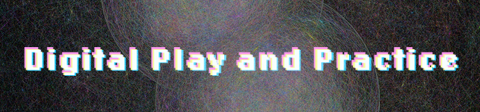
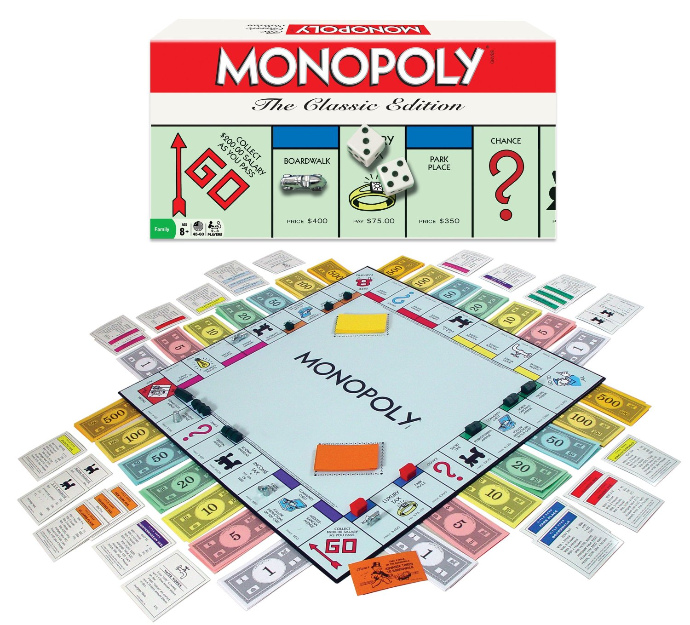
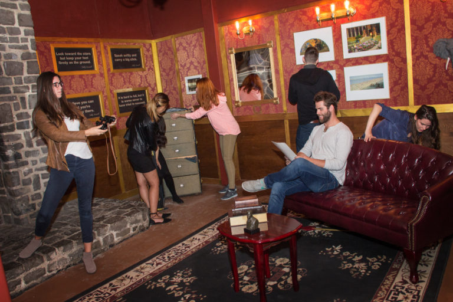
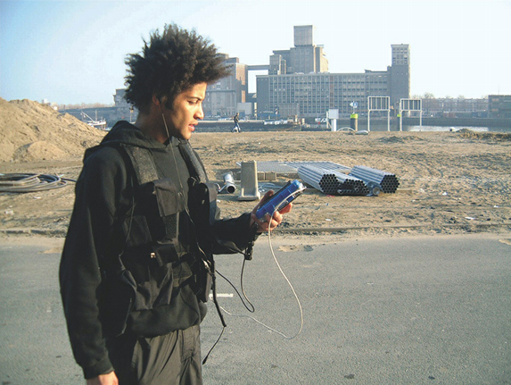
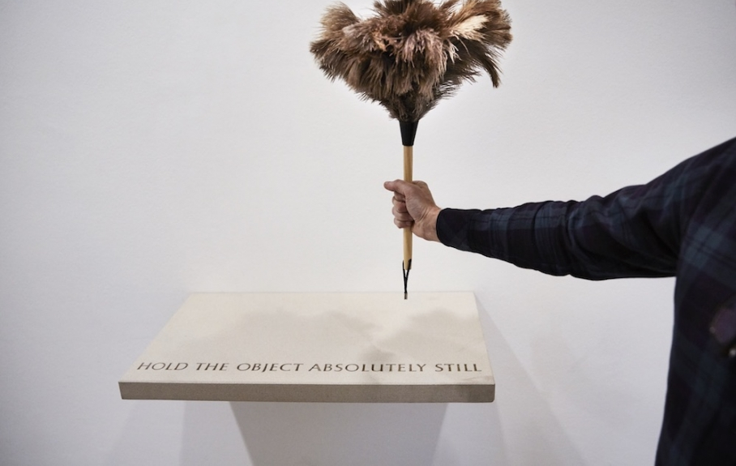

 

# Week 1: Play

FM6102: Digital Play and Practice  
Dr. EL Putnam

---

## Module Handbook

[https://elputnam.gitbook.io/fm6102/](https://elputnam.gitbook.io/fm6102/)

---

## *Spiel*

- *Spiel*: “free and purposeless play, play in the sense of performing or role playing, and also rule-based strategic play (i.e., games)” (Kwastek 71).
- Boundary concept

<!-- Kwastek

Ludology: the study of play

“Play” can be defined in this context as a “boundary concept”—that is, a concept useful for defining research questions that pertain to a variety of disciplines—and for identifying the characteristics that unite or differentiate their individual perspectives.

Kwastek, Katja. Aesthetics of Interaction in Digital Art (The MIT Press) (p. 71). The MIT Press. Kindle Edition. 

Wittgenstein explains, the concept of Spiel is not founded on a single, clear-cut definition; rather, it refers to “a complicated network of similarities, overlapping and criss-crossing.”5 It seems both reasonable and conducive to the aims of this study to unite these various types of action under one generic term as a “boundary concept” that can further the discussion via its different interpretations.

Kwastek, Katja. Aesthetics of Interaction in Digital Art (The MIT Press) (p. 71). The MIT Press. Kindle Edition.  -->

---

## Not just for children

- Friedrich Schiller: *On the Aesthetic Education of Man* (1793)
- *Spieltrieb*: play impulse; communion between the *Stofftrieb* (physical and sensuous impulse) and *Formtrieb* (rational and formal impulse)
- Johan Huizinga: "play is not merely a superfluous activity to be undertaken by children and the idle, but a necessary condition for culture" (Siapera 231) - games define logic and core of culture

<!-- Art education is the means of synthesizing the sensuous with the ability to transcend these sensations through rationality, which allows for the highest degree of human freedom

Relates to aesthetics / experience of art as a means of accessing truth: Discuss aesthetics
	Philosophy of art; how we engage with art – the process of reception
	Kant: beauty and sublime, purposiveness without purpose
	Aisthesis: sensuous experience = see, hear, etc.
	Design and aesthetics: how something looks informs how we use it; informs the senses

Theories of play continued to develop into the 20th century, coinciding with the questioning of what constitutes art and the avant-garde after WWII

Grabner: Friedrich Schiller had already argued in 1795 that it was precisely in play that we find the origins of self-consciousness, and hence freedom, and hence morality.
“glimmers of freedom, or even of moral life, begin to appear everywhere around us.”
 -->

---

## Action for sheer pleasure

"Why does the existence of action carried out for the sheer pleasure of acting, the exertion of powers for the sheer pleasure of exerting them, strike us as mysterious? What does it tell us about ourselves that we instinctively assume that it is?" (Graeber)

<!-- Tendency to think of biological world in economic terms; play tends to be ignored unless it can be granted some purpose

Play as a kind of pleasure not connected to survival and reproduction
 -->

---

## Play as starting point

"What would happen if we proceeded from the reverse perspective and agreed to treat play not as some peculiar anomaly, but as our starting point, a principle already present not just in lobsters and indeed all living creatures, but also on every level where we find what physicists, chemists, and biologists refer to as 'self-organizing systems'?" (Graeber)

---

## Fundamental Characteristics of Play

- Freedom of activity
- Unproductiveness
- Self-containedness
- Not predictable course or outcome, based on inner infinitude
- Rules
- Resides in artificial realm

<!-- Inner infinitude: Scheuerl’s term for describing endless repetitions and variations found in play
Conclusion not real motive behind play

Scheuerl used the concept of ambivalence to explain that play cannot be pinned down in terms of fixed characteristics, but rather constantly oscillates between material and form, seriousness and pleasure, reality and artificiality, rules and chance, nature and intellect:

Kwastek, Katja. Aesthetics of Interaction in Digital Art (The MIT Press) (pp. 78-79). The MIT Press. Kindle Edition. 
 -->

---

## Classifications of play (Roger Caillois)

- Competitive games (*agôn*)
- Games of chance (*alea*)
- Simulation (*mimicry*)
- Pursuit of Vertigo (*ilinx*)

<!-- Caillois also described the two remaining types of play, mimicry and ilinx, as means of escaping the world. He defined mimicry, or simulation, as anything ranging from children’s games of imitation to theater performances. However, the characteristic feature is not the act of presentation, but the creation of a fictitious world, which for Caillois excluded a basis in rules. Games of vertigo (ilinx), according to Caillois, “momentarily destroy the stability of perception” in order to “inflict a kind of voluptuous panic upon an otherwise lucid mind.”40 What is sought in these games, therefore, is a physical or mental unsteadiness that the player finds exhilarating.

Kwastek, Katja. Aesthetics of Interaction in Digital Art (The MIT Press) (p. 80). The MIT Press. Kindle Edition. 
 -->

 ---

 

<!-- Pong: one of the earliest arcade video games; manufactured by Atari

Magnavox Odyssey, first commercial home video game console

 -->

---

## [Blast Theory, *Can You See Me Now?*, 2001 to Present]((https://www.blasttheory.co.uk/projects/can-you-see-me-now/))

<!-- It takes the form of a chase in which online players navigate their avatar through the streets of a city map in order to escape from ‘runners’ in an actual city who are hunting them. The runners – each equipped with a handheld computer-cum-GPS tracker that sends their position to online players via a wireless network – attempt to ‘catch’ those online players, whose position is in turn sent to the runners’ computers.

Paul, Christiane. Digital Art (Third edition)  (World of Art) . Thames & Hudson. Kindle Edition. 

These works function as games, but then again they do not, because they also counteract certain conditions of games, such as their goal-orientedness, the integrity of the players, and the concept of competition. The distinctive feature of these projects is that they contain disruptions that give pause for reflection.

Kwastek, Katja. Aesthetics of Interaction in Digital Art (The MIT Press) (p. 224). The MIT Press. Kindle Edition. 
 -->

---

## Gamification

- "The action or process of making something into or like a game; spec. the application of elements of game playing (such as point scoring, competition with others, etc.) to other areas of activity, typically to encourage engagement with a product or service" ([OED](https://www.oed.com/view/Entry/72087310?redirectedFrom=gamification#eid))

---

## William Forsythe, *City of Abstracts*, 2000

---

## Slit scan camera (p5.js)

-[https://editor.p5js.org/fleshcircuit/sketches/Z_tKHs0u4](https://editor.p5js.org/fleshcircuit/sketches/Z_tKHs0u4)

---

## William Forsythe, *Towards the Diagnostic Gaze*, 2013

