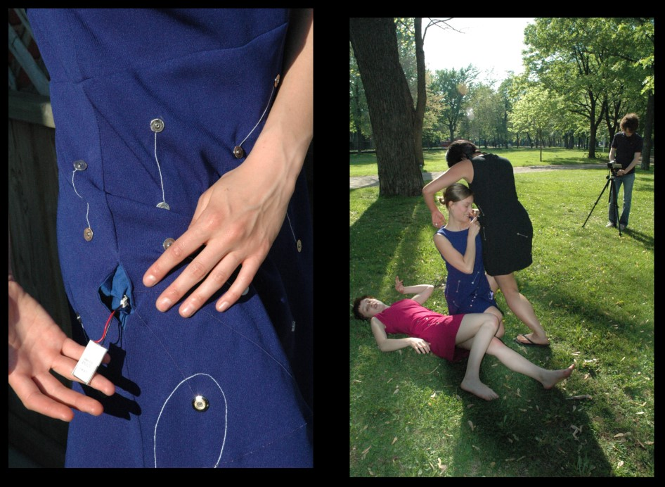
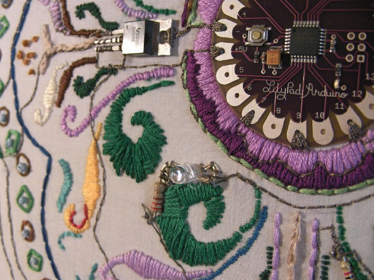

# Week 9: Wearables

FM6102: Digital Play and Practice  
Dr. EL Putnam

---

## What are wearables?

- Capable of being worn; fit or suitable to be worn.

Added June 2016: 
- Designating or relating to a portable device (now esp. one incorporating computer technology) that is designed to be worn on one's person (OED)

<!-- Ryan: Clothing itself as a kind of wearable technology

“Mobile technologies have virtualized our perceptions of reality, but still we feel drawn to the street, to physical spaces and places of mutual looking and interacting, and we still dress to feel culturally visible” (Ryan 1) – not just what tech can do, but connecting wearables to longer history of fashion

Wearable computers, e-textiles, and garments/textiles with microcontrollers more prominent

“the design of embodied technology involves the combination of wearability, location
tracking, the incorporation of sensors, and a range of ergonomic factors, in order to create
something that a user can live with.” (Jethani )
Some wearables by choice, others, like ankle monitoring, are not
 -->

 ---

## Atsuko Tanaka, [Electric Dress](https://youtu.be/wUV-v3xI7Lw), 1956

<!-- Tanaka Atsuko was a leading Japanese avant-garde artist who was known for her experimental works, but who also later worked in abstraction. Her wearable sculpture Electric Dress (1956/86) was her radical response to the government-prescribed figurative styles and accepted materials of art, embracing technology as an agent in its creation. She was associated with the Gutai group of artists, founded in Osaka in 1954. Unlike the work of other Gutai artists, who emphasized gestural physicality as central to the work of art, she assigned the requisite performative action to the lights and bells in her creations. The almost 200 colorfully painted light bulbs of the kimono-like Electric Dress blink on and off every two and a half minutes, creating a flashing performance of moving light that represents systems pulsing inside the human body. In this way, Electric Dress bypasses conventional ideas about the artist as a maker and instead involves the viewer in the act of witnessing this pulsating display. Moreover, although the artist designed the sculpture to be worn as a kind of performance piece, in this example her body becomes merely the support. -->

---

## Diana Dew, Electroluminescent Dress, c. 1966

<!-- Battery pack belt

Diana Dew, a young woman who had experience in both fashion modeling and automobile repair and had spent a year in the engineering program at the University of Florida."'

Susan Elizabeth Ryan. Garments of Paradise: Wearable Discourse in the Digital Age (MIT Press) (Kindle Locations 625-626). Kindle Edition. 

Worked with Paraphenalia: boutique opened by Carl Rosen (director of Puritan Fashions Corporation) and Paul Young in 1965
Nationwide influence but closed by mid 1970s

“the format of dress as its interface face with technology,”

Susan Elizabeth Ryan. Garments of Paradise: Wearable Discourse in the Digital Age (MIT Press) (Kindle Location 640). Kindle Edition. 
 -->

---

## Battery-heated coat, 1968

---

## Margaret Orth, Rehmi Post, et al., Musical Jacket, 1996

<!-- Margaret Orth, who arrived at the Media Lab in 1995. Orth came to the lab with an art, performance, and industrial design background, so she was not the typical Media Lab student. She was not a member of the Borg Lab and did not walk around wearing a computer. She had earned a BFA in painting at the Rhode Island School of Design and an MS in visual studies from MIT's Center for Advanced Visual Studies (CAVS).

Susan Elizabeth Ryan. Garments of Paradise: Wearable Discourse in the Digital Age (MIT Press) (Kindle Locations 947-950). Kindle Edition. 

She began experimenting with fabrics to determine their conductivity. When she brought in a swatch of metallic silk organza from a wedding dress (made from "gimp thread"-with a cotton core wrapped in metal, common to Indian saris-which her fellow student Rehmi Post had also experimented with), she discovered that the fabric was conductive enough to support LEDs.

Susan Elizabeth Ryan. Garments of Paradise: Wearable Discourse in the Digital Age (MIT Press) (Kindle Locations 956-958). Kindle Edition. 

It was an off-the-rack denim jacket (Levi Strauss was a Media Lab sponsor), but it had a functional embroidered keypad (designed by Post) over the left pocket, sewn with conductive thread. When a "key" was touched, it sent a signal to another processor, which in turn ran a small MIDI synthesizer (built by Motorola Fellow Josh Smith and graduate student josh Strickon), worn on the jacket like an embellishment. Sound was projected through miniature speakers in the jacket's pockets. The jacket weighed less than one pound, with most of that coming from batteries and speakers, so it was both functional as a musical instrument and wearable as a garment.

Susan Elizabeth Ryan. Garments of Paradise: Wearable Discourse in the Digital Age (MIT Press) (Kindle Locations 970-973). Kindle Edition.  -->

---

## Maggie Orth, Emily Cooper, et al. Firefly Dress, 1996

<!-- The embroidered image on the front of the dress, difficult to make out in photographs, depicts a firefly, an example of bioluminescence in nature. The dress and necklace are constructed of metallic silk organza, conductive yarns, LEDs, and conductive Velcro, so that circuitry and textiles are merged. The hand-sewn electrical circuits complete themselves when the wearer moves, making the skirt and necklace flicker and change color. Thus the movement is not "read" by the system; rather, the wearer activates the system consciously. This was the only garment in the show that was designed for wearability and commercial appeal, though the prototype was too heavy and expensive to be reproduced.

Susan Elizabeth Ryan. Garments of Paradise: Wearable Discourse in the Digital Age (MIT Press) (Kindle Locations 976-980). Kindle Edition.  -->

---

## Cute Circuit, Hug Shirt, 2002

<!-- Hug Shirt (2006) enhances cell phone contact by recreating senders' sensations of bodily warmth and heartbeat rate, and even transmits to its receivers the physical pressure of a hug-providing the physical dimension of contact usually lost with digital communication. However, repeated Internet publicity for the garment absorbs the larger critique of disembodiment. Rather than provoking thought, it appears as just another cool application.

Susan Elizabeth Ryan. Garments of Paradise: Wearable Discourse in the Digital Age (MIT Press) (Kindle Locations 126-128). Kindle Edition. 
 -->
---

## Cute Circuit, Galaxy Dress

---

## Katy Perry wearing CuteCircuit dress at Met Gala, 2010

---

## Cute Circuit, Twitter Dress, 2012

<!-- Designed for Everything Everywhere in London 2012

Nicole Scherzinger

Integrated texts from social media with the hashtag #tweetthedress
 -->

---

## Joanna Berzowska, Leeches 2007

<!-- designers and artists have repurposed WT innovations and responded to them as systems of meaning.

Susan Elizabeth Ryan. Garments of Paradise: Wearable Discourse in the Digital Age (MIT Press) (Kindle Locations 123-124). Kindle Edition. 

Leeches (2009), LED-illuminated components that resemble fingers or worms, or leeches. These attach to a garment substrate by means of magnetic snaps that act like electrical connections (to a hidden power module at the shoulder). Like bloodsuckers, these "leeches" literally drain power in order to glow red, representing technology as power-thirsty and dangerous.

Susan Elizabeth Ryan. Garments of Paradise: Wearable Discourse in the Digital Age (MIT Press) (Kindle Locations 1722-1723). Kindle Edition. 

The Leech dress explores a different kind of parasitic metaphor. Instead of individualbodies acting as parasites by sucking the energy from other nearby bodies, the parasitesbecome the very devices that we want to power. The dress itself provides power at severaldifferent points of contact. We really wanted to create a garment that explored the conceptof the body itself supplying the energy to recharge our portable electronic devices (whethercell phones or illuminated silicone appendages). The dress itself becomes the powerdistribution grid and the devices can grab on in many different places to suck power
 -->

---

## Joanna Berzowska, Constellation Dress, 2006

<!-- The Constellation dresses are covered with twelve magnetic snaps arranged over the torsoand thighs and connected in pairs through a single line of conductive thread. Light EmittingDiodes are integrated into the dresses in a design that resembles a constellation, with acluster of stars connected to each other through short and straight lines. One set of snapsacts as a switch for the LED circuit and, when connected to the snaps from another dress,the circuit on the garment is closed and the LEDs light up. The magnetic snaps act as amechanical and electrical connection between bodies, and their irregular placement induceswearers to create playful and compelling choreographies to connect their circuits.Rather than being complete and functional electronic pieces in themselves, these garmentswork as meshes on a circuit network and depend on the physical contact of the magneticsnaps to function. By bringing people together mechanically and electronically, thegarments explore metaphors for building electronic or social networks. In addition, thedresses compel people to draw power from each other, hinting at a parasitic model forpowering our mobile technologies
 -->

---

## Google Glass

---

## Spring 2013 Diane Von Furstenberg Runway Show

<!-- Trying to enter the fashion discourse

Susan Elizabeth Ryan notes that in the 1990s, MIT researchers discovered that when it came to wearable technologies, there needed to be an appeal to fashion
 -->

---

## Members of “Borg Lab” at MIT, 1996

<!-- Steve Mann (far left) and Thad Starner (far right)

MIT media lab
 -->

---

## Thad Turner, Private Eye and Display, 1996

---

## [Steve Mann](https://spectrum.ieee.org/geek-life/profiles/steve-mann-my-augmediated-life) wearing his 4th Generation Glass Design, 2013

---

---

---

---

## Wearable Craft

- Grassroots (netroots) approach to electronically/digitally enabled dress
- Tutorials/guides to integrate electronics (like knitting/sewing patterns)
- Combination digital tech with domestic crafts

---

## Arduino

- Open source microcontroller launched in 2005
- Initial core team: Massimo Banzi, David Cuartielles,Tom Igoe, Gianluca, and David Mellis
- Emphasis on availability, simplicity, and sharing knowledge
- Communities online and away from keyboard

<!-- The Arduino's availability and simplicity immediately transformed computing-based art and design education and sparked Arduino communities (the Arduino website itself includes an active blog where users share their inventions and innovations).

Susan Elizabeth Ryan. Garments of Paradise: Wearable Discourse in the Digital Age (MIT Press) (Kindle Locations 2180-2181). Kindle Edition.  -->

---

<!-- need for components that would be both physically and economically flexible enough to drive development of wearables and other soft design. 

In 2006 Leah Buechley, working in the Craft Technology Group of the University of Colorado at Boulder, launched an E-Textile Construction Kit to serve an educational function: encouraging greater diversity among electrical engineering  and computer science students.

Susan Elizabeth Ryan. Garments of Paradise: Wearable Discourse in the Digital Age (MIT Press) 
-->
---

<!-- Simple soft circuit: battery, resistor, LED, conductive thread -->

---

## LilyPad

- Launched in 2007 by Leah Buechley
- Based on Arduino programming language, but sewing friendly
- Released for sale in 2008 by SparkFun Electronics

<!-- 
part of growth of markerism and digital craft 
-->

---

## Becky Stern, *A Tribute to Leah Buechley,* 2008

<!-- Embroidery using conductive and nonconductive thread; produces light and sounds in response to light sensor -->

---

## Ladyada: Adafruit

- Limor Fried: Electrical Engineer and founder of Adafruit Industries (2005 to present)
- [www.adafruit.com](https://www.adafruit.com)
- Interest in critical design, maker movement, and open source platforms

 <!-- For part of her MA she created a project called *Social Defense Mechanisms: Tools for Reclaiming Our Personal Space*. Following the concept of critical design she prototyped glasses that darken when a television is in view, and a low-power RF jammer that prevents cell phones operating in a user's personal space. 
 
 First woman on cover of Wired Magazine in 2011-->

 ---

<!-- Data input and output

Different types of sensors collect different data
Output: visual, sonic, haptic
 
 Refer to pdf: introducing circuit playground 
 -->

---

## Kathleen McDermott, [Absurdist Electronics](https://hubs.mozilla.com/cJFhgVF/absurdist-electronics)

[Interview with Kathleen McDermott](https://vimeo.com/639288271)

[Urban Armor: DIY wearable electronics instructions](https://urbanarmor.org/)
<!-- Interdisciplinary media artist and technology designer Kathleen McDermott, PhD is an Industry Assistant Professor at NYU. Her work has been featured in The Wall Street Journal, Huffington Post, Fast Company, and Dezeen, and has been exhibited internationally. In this virtual interview with DAHJ Gallery Director Francesca Albrezzi, they use avatars to conduct their discussion within the VR gallery. Their conversation spans McDermott’s approach to wearables, the intersection of gender and design, the influence of the Dadaist movement and Alvin Toffler’s notion of “future shock,” and the interconnectedness of performance, performativity, and embodiment. -->