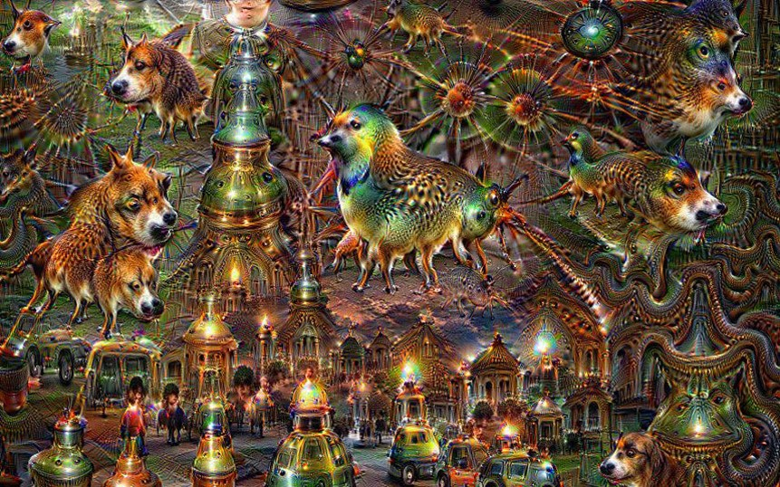

# Week 2: Aesthetics

FM6102: Digital Play and Practice  
Dr. EL Putnam

---

## What is Aesthetics?

* Aisthesis: sensation, perception
* Philosophy of art
* Applied aesthetics: industry-specific rules and guidelines used in trade crafts such as cinematography,  graphic  design,  television  production,  website  design,  and  photography. 

---

## Immanuel Kant (1724 – 1804)

- Aesthetics: beauty and the sublime
    - *Critique of Judgment*
- Subjective: occurs in subject
- Beauty causes pleasure as it is agreeable
- Sublime is beyond all comparison; first causes displeasure, but then pleasure (for Kant, relates to nature, like thunderstorm)
- Free play as opposed to focused study
- Common sense – judgments of beauty universal and grounded in real world (response of subject to object)
- Purposiveness without purpose – disinterestedness
- For more details see ["Kant's Aesthetics and Teleology"](https://plato.stanford.edu/entries/kant-aesthetics/) in the *Standford Encyclopedia of Philosophy*

---

---

## Sianne Ngai, *Our Aesthetic Categories*

- Zany: performing as artful play and affective labour
- Interesting: difference in form of information and its pathways
- Cute: wide spectrum of feeling, from tenderness to aggression, used in conjunction with subordinate and unthreatening commodities 

---

## Zany examples

- [*I Love Lucy* chocolate factory scene](https://youtu.be/NkQ58I53mjk)
- [*The Office* fire drill scene](https://youtu.be/gO8N3L_aERg)
- [Todrick Hall, "Mask, Gloves, Soap, Scrubs"](https://youtu.be/9WYA6dE8QPk)

<!-- The zany, the cute, and the interesting thus call forth not only specific subjective capacities for feeling and acting but also specific ways of relating to other subjects and the larger social arrangements these ways of relating presuppose. In doing so, they are compelling reminders of the general fact of social difference and conflict underlying the entire system of aesthetic judgement or taste, making that underlying condition transparent in
Ways which many other aesthetic categories do not. (Ngai 11)

The aesthetic categories in this study thus refer to basic human and
social competences increasingly encroached on by capitalism over the
past half century: affect and emotion, in the case of zaniness; language and communication, in the case of the interesting; intimacy and care, in the case of the cute (Ngai 13)

It is because the zany, the interesting, and the cute index the uncertain status of performing between labor and play, the increasing routing of Art and aesthetic experience through the exchange of information, and The paradoxical complexity of our desire for a simpler relation to our
Commodities that they are "about" production, circulation, and consumption
 -->

---

## Interesting Examples

- [Selfiecity](http://selfiecity.net/)
- [Claudia Weber Train Delay Scarf](https://mymodernmet.com/claudia-weber-rail-delay-scarf/)
- [Conor McGarrigle, *Latent Space*](http://latent-space.art/)

---

## Cute examples

- ["Baby Laughing Hysterically at Ripping Paper"](https://youtu.be/RP4abiHdQpc)
- [Lil Bub](https://youtu.be/gNyW-GKOG2k)
- AR filters in social media

---

## Yves Citton, The Ecology of Attention (interpreted by McKenzie Wark) 

- The value of attention: not just treated in economic terms
- Attention ecology instead of attention economy
- Entanglements of network
- Politics and aesthetics of attention
    - Alertness
    - Loyalty
    - Projection
    - Immersion
- Need to start paying attention to attention

<!-- Attention is not a new concern. The ancient art of rhetoric was about taking and holding it. 207 Among the moderns, attention to innovation in style has long been a way of renewing attention. One might connect this to the way Sianne Ngai thinks about the aesthetics of the zany, interesting, and cute, each of which draws attention to, and also away from, aspects of modern life, to production, circulation, and the commodity, respectively. Warhol pioneered forms of all three as ways of attracting attention.

McKenzie Wark. Sensoria: Thinkers for the Twenty-First Century (Kindle Locations 1037-1041). Verso. 

Economy focuses on individual, attention ecology focuses on regimes that production individuals – social impact, how did we get this way?

An economy attending only to a metrics of attention has no way of measuring or even really knowing what is needed to reproduce the conditions of attentiveness themselves.

McKenzie Wark. Sensoria: Thinkers for the Twenty-First Century (Kindle Locations 1061-1062). Verso. 

Alertness attends to warnings and threats, to what has to be excluded. Loyalty is the opposite pole; it is about trust, mutuality, solidarity, community, what “binds” us through the long term. Projection is looking outward from the familiar, looking for what is mine or ours. Immersion is allowing the strange or the new to come in. Immersion fascinates, projection bedazzles, loyalty hypnotizes, alertness excites.

McKenzie Wark. Sensoria: Thinkers for the Twenty-First Century (Kindle Locations 1077-1080). Verso. 

Citton thinks we can start paying attention to attention itself as something that can be learned, cultivated, practiced, designed, in ways that produce forms of both collective and individuated becoming. To do so involves stepping down a scale, from attention ecologies to forms of joint attention and finally to individuated attention. It is helpful to fixate on neither the big picture nor the individual, but to look at what could mediate in-between.

McKenzie Wark. Sensoria: Thinkers for the Twenty-First Century (Kindle Locations 1146-1149). Verso. 
 -->

 ---

 ## Ecologies of Attention

- Different ecologies
    - The radical: rebuild practice of what can be seen, heard, known, shared, from the ground up, such as Occupy Wallstreet and Black Lives Matter
    - The managerial: comes from institutional forms

<!-- Citton mentions two ecologies: the radical and the managerial. The radical ecology of attention comes out of things like the Occupy Wall Street or Black Lives Matter movements. It wants to rebuild the whole practice of what can be seen, heard, known, shared, from the ground up. The managerial ecology of attention comes out of things from institutional forms that try to hold the line against the complete subsumption of attention into the regime of exchange value. It operates on a slightly bigger scale and is perhaps less bracing in its ambitions. Citton wants us to attend to both rather than choose between them. After all, part of steering away from attention in the modes of alertness and projection is to background the habit to digitize, to binarize, to make it all about us or about them.

McKenzie Wark. Sensoria: Thinkers for the Twenty-First Century (Kindle Locations 1172-1177). Verso. 

Citton ends rather than starts with individual attention, because he is interested in asking not how it can be instrumentalized by an attention economy but how it is produced in the first place by an attention ecology.

McKenzie Wark. Sensoria: Thinkers for the Twenty-First Century (Kindle Locations 1198-1199). Verso. 

 -->

---

## Modes of Attention

- Shorthand of four modes of attention
    - Projection + loyalty = classical art
    - Alertness + projection = culture industry
    - Immersion + alertness = modern art
    - Loyalty + immersion = arts of interpretation.

<!-- If one is to make good art, good politics, or good media, it might help to start with the current attention economy and a knowledge of its limits. One can make good work in it, but what it will consider good work is what it can measure. One might want to think of the good as another kind of value or at least another kind of measure.
    
McKenzie Wark. Sensoria: Thinkers for the Twenty-First Century (Kindle Locations 1235-1237). Verso.  -->

---

## TL/DR

Attend to the in-between spaces. Avoid the binaries. Observe the connections. And act on them.

---

<!-- Computer vision: when computers see, identify, and process images in same ways humans do

DeepDream is a computer vision program created by Google engineer Alexander Mordvintsev which uses a convolutional neural network to find and enhance patterns in images via algorithmic pareidolia, thus creating a dream-like hallucinogenic appearance in the deliberately over-processed images.

How to recognize something in sheer noise? A striking visual example of pure and conscious apophenia was recently demonstrated by research labs at Google:

Hito Steyerl. Duty Free Art (Kindle Locations 770-771). Verso. 

Neural networks were trained to discern edges, shapes, and a number of objects and animals and then applied to pure noise. They ended up “recognizing” a rainbow-colored mess of disembodied fractal eyes, mostly without lids, incessantly surveilling their audience in a strident display of conscious pattern overidentification.
 -->

---

<!-- The creature that stares at you from your plate of spaghetti and meatballs is not an amphibian beagle. It is the ubiquitous surveillance of networked image production, a form of memetically modified intelligence that watches you in the shape of the lunch that you will Instagram in a second if it doesn’t attack you first.

Hito Steyerl. Duty Free Art (Kindle Locations 805-807). Verso. 

Today, expressions of life as reflected in data trails become a farmable, harvestable, minable resource managed by informational biopolitics.

Hito Steyerl. Duty Free Art (Kindle Locations 824-825). Verso. 

Once one accepts that the patterns derived from machinic sensing are not the same as reality, information definitely becomes available with a certain degree of veracity.

Hito Steyerl. Duty Free Art (Kindle Locations 846-847). Verso. 

Steyerl’s concern is how CV is put into use and the truth claims of big data -->

---

## Hito Steyerl, *How Not to Be Seen: A Fucking Didactic Educational .MOV File* (2013)

[https://www.youtube.com/watch?v=LE3RlrVEyuo](https://www.youtube.com/watch?v=LE3RlrVEyuo): change playback speed to 1.25
[Hito Steyerl: Being Invisible can be deadly](https://www.tate.org.uk/art/artists/hito-steyerl-22462/hito-steyerl-being-invisible-can-be-deadly)

--- 

## black midi, "John L," music video (2021)

[https://youtu.be/GT0nSp8lUws](https://youtu.be/GT0nSp8lUws)
