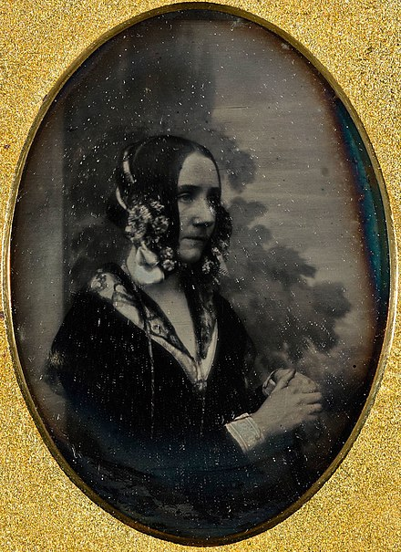
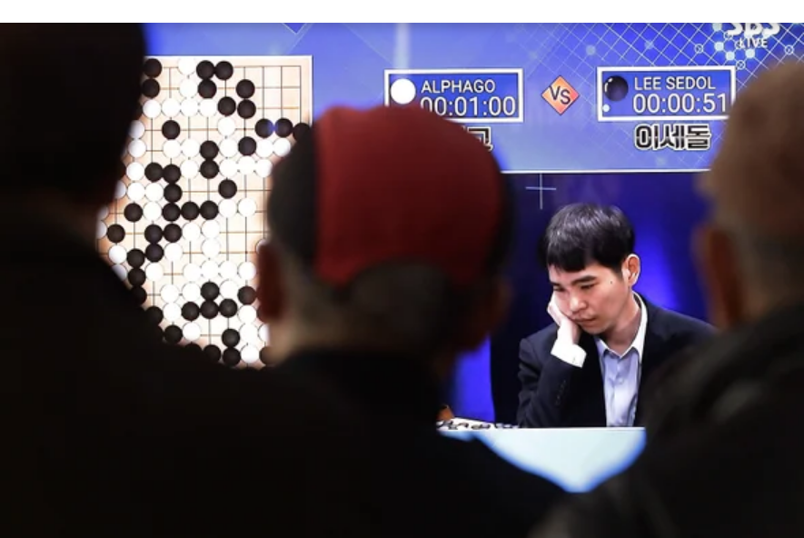
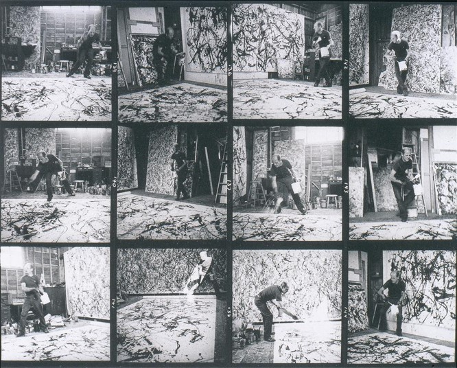
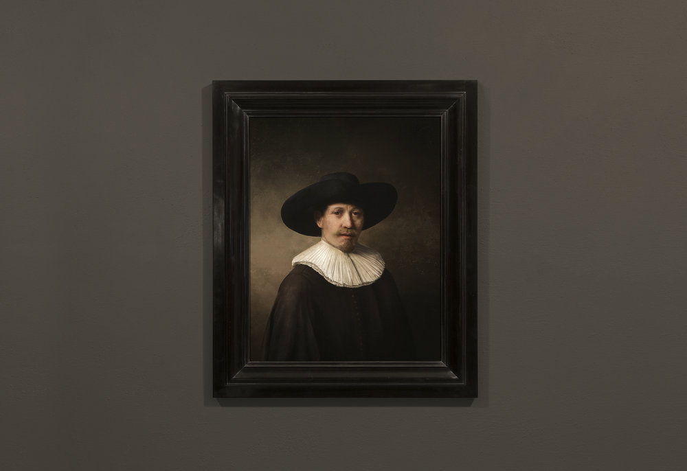
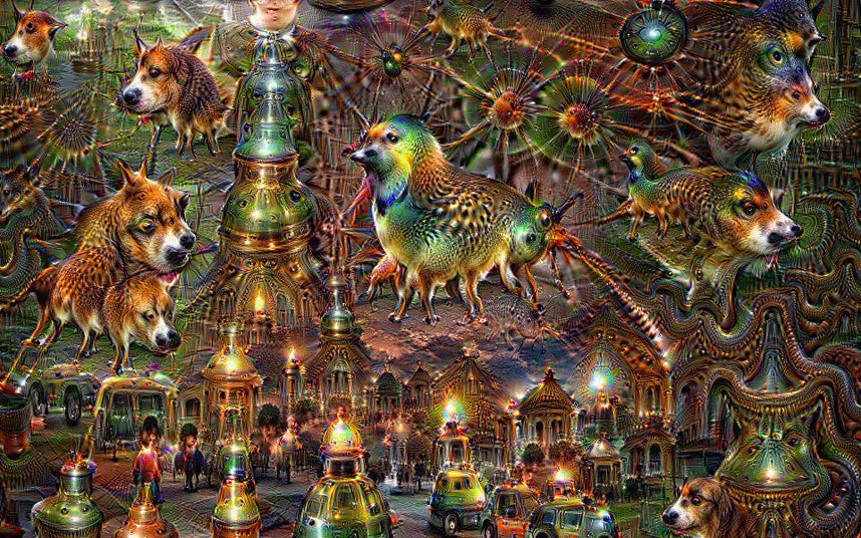

# Week 3: Creativity

FM6102: Digital Play and Practice  
Dr. EL Putnam

---

## What is Creativity?

- OED: The faculty of being creative; ability or power to create.
- Marcus Du Sautoy: the drive to come up with something new, is surprising, and has value (3)
- Oli Mould: creativity is a power – who or what has power to be creative?

---

## Three Types of Creativity

- Proposed by Margaret Boden (discussed in Du Sautoy 7 - 11)
- Exploratory creativity: taking what is already there and exploring the outer edges
    - Accounts for 97% of human creativity
    - Area where computers excel
- Combinational creativity: taking two different constructs and finding a new way to combine them
    - Potential for AI
- Transformational creativity: rare moments that are complete game changers
    - Paradigm shifts and transformational moments
    - Abstraction in painting

<!-- Bach as example of exploratory creativity in Baroque music, pushing boundaries and entering new era music 

Abstraction in painting as a kind of creative game changer: from representation to form

-->

---

Could a computer initiate the kind of phase change that can move us into a new state? That seems a challenge. Algorithms learn how to act based on the data presented to them. Doesn’t this mean that they will always be condemned to producing more of the same? (Du Sautoy 11)

---

## Lovelace Test

"To pass the Lovelace Test, an algorithm has to produce something that is truly creative. The process has to be repeatable (not the result of a hardware error) and the programmer has to be unable to explain how the algorithm produced its output" (Du Sautoy 6)

<!-- Ada Lovelace: created first algorithm for Charles Babbage’s analytical engine; often referred to as first computer programmer

Daughter of Lord Byron (poet)

Understood that you can’t get more than you put into a machine, but as Du Sautoy points out, thought about possibility of other applications for Analytical Engine could do more than work on numbers – sill relies on coder not machine

Sautoy proposes Lovelace text: To pass the Lovelace Test, an algorithm has to produce something that is truly creative. The process has to be repeatable (not the result of a hardware error) and the programmer has to be unable to explain how the algorithm produced its output. We are challenging the machines to come up with things that are new, surprising, and of value.

For a machine to be deemed truly creative, its contribution has to be more than an expression of the creativity of its coder or the person who built its data set.

 -->

---

## Turing Test

- developed by Alan Turing
- Tests machine's ability to exhibit intelligent behaviour
- Based on imititation game

<!-- Player A is a man, player B is a woman and player C (who plays the role of the interrogator) is of either sex. In the imitation game, player C is unable to see either player A or player B, and can communicate with them only through written notes. By asking questions of player A and player B, player C tries to determine which of the two is the man and which is the woman. Player A's role is to trick the interrogator into making the wrong decision, while player B attempts to assist the interrogator in making the right one. -->

---

## AlphaGo defeats Lee Sedol, world champion Go player

<!-- In 2016, World champion Go play, Lee Sedol lost to AlphaGo, Google’s artificial intelligence program (neural network algorithms) – trained over time using reinforcement learning / training algorithms like teaching children, as opposed to top down programming where you just provide instructions

(ch. 3) The computer played a move a human would not even consider – capable of playing more games and recalling moves learned more efficiently, think/strategise in game longer term than human players: broke convention and defied orthodoxy as it was not contained to human “creativity code”
 -->

---

## What is AI?

- Artificial intelligence, or technological intelligence that mimics human intelligence
- Founded as academic discipline in 1956 (first wave cybernetics)
- Current wave: machine learning and neural networks, impact of big data (mass scale data mining)
    - 90% of world's data created in last five years; one exabyte of data is created on internet everyday
    - In two days, humans produce same data it took us to create from dawn of civilization to 2003 (Du Sautoy 62)
- [Neural Network in 5 minutes](https://youtu.be/bfmFfD2RIcg)

---

## Learning from Failure

- “Try. Fail. Fail again. Fail better." (Samuel Beckett quoted in Du Sautoy 14)
- "Unless you are prepared to fail, you will not take the risks that will allow you to break out and create something new. This is why our education system and our business environment, both realms that abhor failure, are terrible environments for fostering creativity" (Du Sautoy 14)

---

## Jackson Pollock, *Number 5,* 1948

- Richard Taylor: Pollock's paint arcs like chaotic pendulum
- Creates fractals: zoom in on section, difficult to differentiate from whole
- Abstract representations of nature

<!-- 
chaotic pendulum, which has a pivot that
moves around instead of remaining fixed.

It turns out that emulating Pollock’s approach isn’t
quite so simple as one might think. Pollock moved around a lot as he dripped paint onto a canvas. At the best of times, working rapidly, he was off-balance. Often, he was drunk. The resulting images are visual representations of the movement of his body as he interacted with paint and canvas.
Yet that doesn’t mean his technique can’t
be simulated by a machine. -->

---

## Jackson Pollock, *Mural*, 1943

<!-- 
As you zoom in on a section, it
becomes difficult to distinguish the zoomed-in section from the whole.
Approaching the painting, you lose your sense of place in relation to
the canvas and begin to mentally fall into the image.

Tendency to treat Pollock’s paintings as insignificant, but not an easy process to emulate; not just flicks of paint but fractals
DuSautoy tried to replicate with a chaotic pendulum – replicate technique out lacked the structure. 

“This seems to be a fundamental limitation of many of the codes attempting to make art. They can capture detail at a local level but they lack the ability to piece these bits together into a canvas that is satisfying on a larger scale” (117) -->

---

## Hans Namuth, Jackson Pollock at work in his studio, 1950

[Hans Namuth, *Jackson Pollock 51* (1951)
](https://youtu.be/atu4uVT7bV8?t=319)

---

## Computer generated Rembrandt

<!-- A Rembrandt created by a 3D printer based on 346 paintings
Caused disgust in some people, including British art critic Jonathan Jones
DuSautoy asks: “The artist’s process is often a black box. Algorithms have given us new tools to dig around inside the box and to find new traces
of patterns. If we can replicate through code what an artist has done, then that code reveals something about the process of creation” (122)

Treating creativity as competitive game to “spur computers into new and more interesting artistic territory” (124) – Ahmed Elgammal make creativity a competitive game at the algorithmic level to mimic competative dialogue between generator and discrimatator (desire to create and the inner critic)
 -->

---

## Oli Mould, *Against Creativity* (2018)

- Creativity as the "power to create something from nothing" (Kindle loc 76) -- places emphasis on power
- Blends knowledge with agency and desire to create something that does not exist
- Creativity being used as a concept in order to proliferate more of the same (esp. in neoliberal capitalism)

---

## Technological Innovation 

- Silicon Valley: mentality of the hacker
    - current global hub of digital innovation and promotion of creativity in computing technologies
    - “move fast and break things”: shun management for innovation
- Emphasis on agility and building on innovations of others
- Creativity and the capacity to monetize everything (ie. sharing economy): market based creativity

---

## Creative Destruction

- Concept coined by  Joseph Schumpeter: a kind of mutation “that incessantly revolutionizes the economic structure from within, incessantly destroying the old one, incessantly creating a new one” and “is the essential fact about capitalism.” (Schumpeter 83)
- destroy alternatives and turn them into fertile and stable ground for growth
- Shoshana Zuboff: common understandings of "creative destruction" misinterpretation of Schumpeter
    - Treated as "permissionless innovation" (Zuboff 49)
    - need double movement: translated into new institutional forms

<!-- Although Schumpeter regarded capitalism as an “evolutionary” process, he also considered that relatively few of its continuous innovations actually rise to the level of evolutionary significance. These rare events are what he called “mutations.” These are enduring, sustainable, qualitative shifts in the logic, understanding, and practice of capitalist accumulation, not random, temporary, or opportunistic reactions to circumstances. Schumpeter insisted that this evolutionary mechanism is triggered by new consumer needs, and alignment with those needs is the discipline that drives sustainable mutation: “The capitalist process, not by coincidence but by virtue of its mechanism, progressively raises the standard of life of the masses.”

Zuboff, Shoshana. The Age of Surveillance Capitalism (p. 51). PublicAffairs. Kindle Edition.  -->

---

## Algorithmic Creativity

- Every interaction we have with technology produces data: big data (data mining on a mass scale)
- Algorithm is a set of programmed instructions that dictates an action
- Artificial intelligence and development of artificial creativity (like what Du Sautoy discusses)
- Algorithmic creativity: emphasis on data mining
- Technosolutionism or technochauvenism: use of technology to solve non-technological problem, but can cause further problems
    - See Broussard, Meredith. *Artificial Unintelligence: How Computers Misunderstand the World.* The MIT Press, 2018.

<!-- the way to work in the twenty-first century is to shun management’s control because it denies agility, speed and creativity. Seeking out, investing in, then taking over young, energetic, bright and innovative new people and firms mirrored this hacker ethos.

Oli Mould. Against Creativity (Kindle Locations 1435-1436). Verso. 

Emphasis on competitive markets

pervades how creativity is thought of in relation to technology; the more technology individualizes us and creates a social world geared toward the monetization of everything, the more money there is to be made. Any social utility of this creative technology is snuffed out in favour of how it can be implemented to feed capitalism’s growth.

Oli Mould. Against Creativity (Kindle Locations 1458-1460). Verso. 

From tech to how we experience the everyday: tech informs our engagement with the world; we are behaving in ways informed by this mentality

Mould more wary of implications while DuSautoy celebrates: “Machine learning algorithms hence forge a path for us through the amorphous soup of virtual information, all the while narrowing our field of vision.”

Oli Mould. Against Creativity (Kindle Locations 1571-1572). Verso. 

Critical of sharing economy

 -->

---

<!-- Computer vision: when computers see, identify, and process images in same ways humans do

DeepDream is a computer vision program created by Google engineer Alexander Mordvintsev which uses a convolutional neural network to find and enhance patterns in images via algorithmic pareidolia, thus creating a dream-like hallucinogenic appearance in the deliberately over-processed images.

DuSautoy: Art enables seeing into how another mind works – art made by AI could enable use to understand hidden nature of computer code (134-5)

While for DuSautoy,creativity is the black box, for Mould Machine learning are the black boxes (training data and how they function are corporate secrets)

Algorithms reaffirm, rather than enable new ways of organizing society – focus on indivudal rather than collective -->

