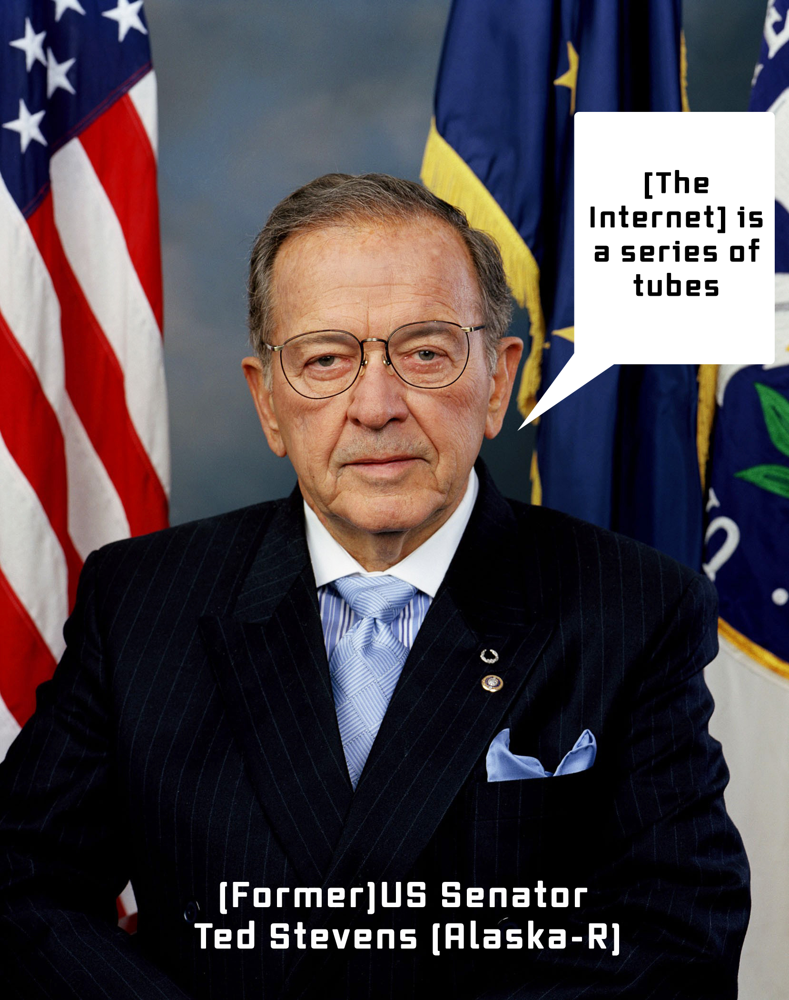

# Week 4: Digital Media Geologies

FM6102: Digital Play and Practice  
Dr. EL Putnam

---

<!-- 
Kate Crawford opens chapter on Earth with description of Silicon Valley -- last week I mentioned its significance as a geogrphic location: why does this matter? 

Search on Google Earth; go to Clayton Valley

Silicon Valley, in the southern San Francisco Bay Area of California, is home to many start-up and global technology companies. Apple, Facebook and Google are among the most prominent. It’s also the site of technology-focused institutions centered around Palo Alto's Stanford University. The Computer History Museum and NASA’s Ames Research Center are in Mountain View. The Tech Museum of Innovation is in San Jose.

History of San Francisco and California one of mining, gold rush, extraction -- get rich quick; "move fast and break things"

-->

---

<!--  -->

"The valuable lithium brine under the surface is pumped out of the ground and left in open, iridescent green ponds to evaporate. From miles away, the ponds can be seen when they catch the light and shimmer. Up close, it’s a different view. Alien-looking black pipes erupt from the ground and snake along the salt-encrusted earth, moving in and out of shallow trenches, ferrying the salty cocktail to its drying pans" (Crawford 25)

<!--

"The mining town, one of the oldest in Nevada, was almost abandoned in 1917 after the ground was stripped bare of silver and gold. A few gold rush buildings still stand, eroding under the desert sun. The town
may be small, with more junked cars than people, but it harbors something exceedingly rare. Silver Peak is perched on the edge of a massive underground lake of lithium" (Crawford 24)

Extraction and mining typically not considered when discussing technological progress

White Lithium crystal as grey gold

Why is lithium important? From smart phones to electronic cars

-->

---

<!-- 
Extraction and media development is global

Media not just representations, nor is it just hardware and software, but the material of hardware and infrastructures

Parker emphasizes how materialism does not always include geology

Materials that go into producing and supporting tech, also rethinking time (geological time surpasses human comprehension of time)

Geological extracts: drawing from the planet’s resources and supports by a multiplicity of infrastructures

Coltan from Africa
Zinc ore from Red dog pit mine in Alaska and refined into indium in Trail Canada

“geology
does not refer exclusively to the ground under our feet. It is constitutive
of social and technological relations and environmental and ecological
realities.” (Parker 46)

Scientific experimentation of media: centuries of study, inquiry (physics, chemistry, even alchemy)

“techniques of experimenting with different reactions and combinations of elements and materials are also media practices. Our screen technologies, cables, networks, technical means of seeing and hearing, are partly results of meticulous—and sometimes just purely accidental—experimentation with how materials work: what works, what doesn’t, whether you are talking of materials for insulation, conduction, projection,
or recording.” (Parker 57)
 -->

---

## Molleindustria, [Phone Story](http://phonestory.org/), 2011

<!-- Phone Story is an educational game about the dark side of your favorite smart phone. Follow your phone's journey around the world and fight the market forces in a spiral of planned obsolescence.

Parker: Communicational events are sustained by the broader aspects of geology of media. They include technologies abandoned and consisting of hazardous material: lead, cadmium, mercury, barium, and so on (49)

Humans biological and geological agents

 -->

---

## John Gerrard, [FARM (PRYOR CREEK, OKLAHOMA)](http://www.johngerrard.net/farm-pryor-creek-oklahoma-2015.html), 2015

<!-- 
Not just geological mining, but also data mining: "The new extractivism of data mining also encompasses and propels the old extractivism of traditional mining" (Crawford 31)

Transatlantic cables not just physical, but depend on a histry of colonialism

Google data server building in Oklahoma, also known as a ‘data farm’.  

Physical material infrastructures of the internet (invisible in many contexts): the data centre

https://www.google.com/about/datacenters/locations/dublin/

Data mining not the only kind of mining: digital tech requires geological materials / history of geology in media

Cloud computing, which may be promoted as a green tech, relies on Carbon-based energy sources

“Data processing needs energy, which releases heat, of course. Data demand their ecology, one that is not merely a metaphorical technoecology but demonstrates dependence on the climate, the ground, and the energies circulating in the environment. Data feeds of the environment both through geology and the energy-demand. What’s more, it is housed in carefully managed ecologies. It’s like the natural elements of air, water, fire (and cooling), and earth are mobilized as part of the environmental aspects of data. Data mining is not only about the metaphorical big data repositories of social media.” (Parker 24)

 -->

---

## Google Data Farms in Ireland

[https://www.google.com/about/datacenters/locations/dublin/](https://www.google.com/about/datacenters/locations/dublin/)

"Minerals are the backbone of AI, but its lifeblood is still electrical energy. Advanced computation is rarely considered in terms of carbon footprints, fossil fuels, and pollution; metaphors like 'the cloud' imply something floating and delicate
within a natural, green industry" (Crawford 41).

Mulligan, John. [“Data Centres ‘Could Use up to 31pc’ of Power by 2030, Study Reveals.”](https://www.independent.ie/business/irish/data-centres-could-use-up-to-31pc-of-power-by2030-study-reveals-40958440.html.), Independent, 18 Oct. 2021, 

---

["Series of Tubes" Wikipedia page with audio clips](https://en.wikipedia.org/wiki/Series_of_tubes)

<!-- In 2006, US senator Ted Stevens described the internet as a series of tubes: emphasise material properties, but here to counter net neutrality
 -->

---

## Anthropocene

- Suggested by Paul Crutzen (2000)
- Description of geological era from Industrial revolution (18th/19th century) 
- Massive changes human practices, technologies, and existence on planet

<!-- 
Crutzen: noble prize winning chemist
Starts with steam engine – use of fossil fuels
History of latex for transatlantic cable: awareness of human impact on environment back to Victorian era
 -->

---

“Humans leave their mark, and the earth carries it forward as an archive” (Parker x)

---

## Edward Burtynsky, [China Recycling #9](https://www.edwardburtynsky.com/projects/photographs/china)

<!-- iPhones along with other tech becomes geological waste

Technology presented in terms that hide its material and geological properties:  these aspects make tech possible and have ecological impact. Tech is MADE by humans; digital is not immaterial

E-waste is hazardous and its processing is a high-risk endeavor even in state-of-the-art facilities. In China, e-waste recycling is, for the most part, not yet a refined industry. Once the scrap arrives at its destination, workers use their hands and primitive tools to pick apart the junked computers and salvage precious components. In the process they expose themselves and their environment to toxic elements such as lead, mercury and cadmium.
 -->

---

## Planned Obsolescence

Sean Cubitt: “the digital realm is an avant-garde to the extent that it is driven by perpetual innovation and perpetual destruction” (quoted in Parker 14)

---

## Zombie Media

- Media never die: remain toxic waste residue
- We should be able to repurpose and reuse solutions (circuit bending and hardware hacking)
- See Benjamin Gaulon [Recyclism](http://www.recyclism.com/all.html)

--- 

## What are the fossils of the future?

Group activity: 20 minutes

- Break into groups of 2 to 3 people
- Select reporter (someone to take notes and present on your groups ideas back to class)
- Prompt: geologists/archaeologists 500 years in the future are sifting through core samples and artefacts from our current time: who are they? What do they find?
- Form: consider how story can be presented (ie. Sci-fi film, documentary, animation, video game, VR, installations, sound piece, locative media). Select at least two different types of presentation and brainstorm on how it can be presented.