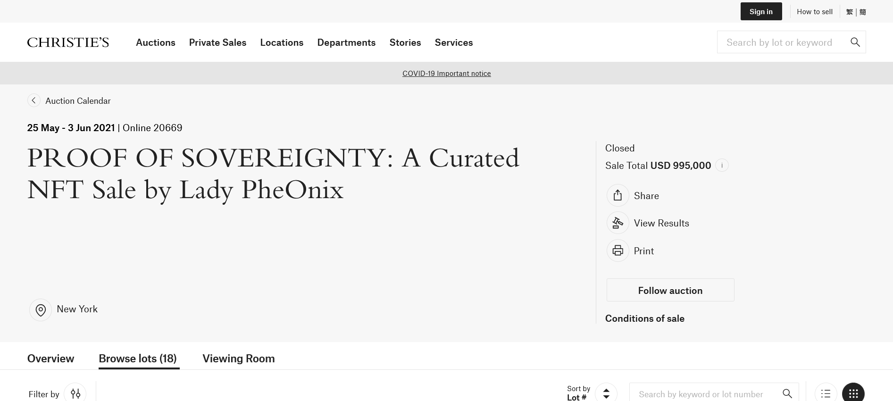
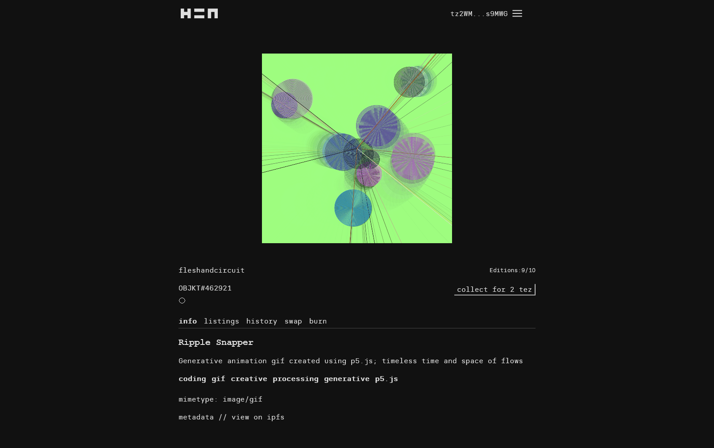

# Week 5: Blockchain and Crytocurrency

FM6102: Digital Play and Practice  
Dr. EL Putnam

---

"Almost all verbal conversations involving the blockchain begin and end the same way, too: in perplexity. This is the first information technology I’ve encountered in my adult life that’s just fundamentally difficult for otherwise intelligent and highly capable people to comprehend. In part, this is due to the very particular framework of assumptions about human nature that drove the blockchain’s design, a framework that (we may rejoice) is by no means universally shared. But most of it is down to the almost fractal complexity Bitcoin and its underlying technologies confront us with" (Greenfield ch. 5).

<!-- But where Bitcoin, the blockchain and related technical developments are concerned, there aren’t really any handy metaphors we can bring to bear. The ones that do get pressed into use are, for most of us, counterintuitive.

Adam Greenfield. Radical Technologies: The Design of Everyday Life (Kindle Locations 1890-1891). Verso.  -->

---

## What is Blockchain?

- An immutable, distributed, ledger used to record transactions and track assets (ie. smart contracts, decentralised economies, autonomous organisation, distributed applications)
- Asset: can be tangible (car, house, cash, land) or intangile (patents, copyright, brand)
- Anything can be tracked and traded on blockchain, even pre-nuptial agreement (see Greenfield ch. 6)

<!-- May here is as the basis on Web 3.0; if Web 2.0 was about UGC, Web 3 is about Blockchain -->

---

## Bitcoin

- Electronic coin as a chain of signatures
- Invented by "Satoshi Nakamoto" in 2008 
- Decentralised purely digital currency: not backed by bank, but peer-to-peer electronic cash system
- Founded on computational code breaking (hence crypto)

---

## How it works: Overview

- Every transaction creates a block of data
- Each block is connected to ones before and after it
- Transactions are blocked together in the irreversible chain of the block chain
    - makes it tamper-evident and adds strength
    - building a ledger builds trust
    - Value of currency maintained by "emergent process of consensus among a globally distributed network of peers" (Greenfield ch. 5).

    <!-- Greenfield notes how every digital transaction is nothing more than an entry in a database, though this ledger usually belongs to the bank
    
    Bitcoin presents ledger as decentralised -- no bank as central authority 
    
    One shared, public record, jointly maintained by the global network, would suffice to record all transactions, all contracts, and all votes, and do so safely, incorruptibly and in a way that preserves the privacy of all parties.-->

---

---

## Building the chain

- Every Bitcoin and bitcoin user has unique identifier: cryptogrphic signature
- Entire chain of custody of coin is recorded and available
- Transactions happen between wallets (accounts)
- Every transaction has hash value (cipher that is 256 bits long) and is unique
- Transactions are propagated across entire global network of bitcoin users
- Validity of entire chain is computationally verified every time a new block is added to it

<!-- Every node independently does the work of inspecting the history of previous transactions in order to verify the one now before it, and ensure its compliance with criteria for validity that are rigorously specified by the Bitcoin protocol. For example, to prevent a double spend, the protocol stipulates that only the earliest transaction involving a given coin is legitimate; any attempt by the same party to spend it again will be rejected by the network. Similarly, if rather more obviously, nobody can spend a coin they didn’t own in the first place. As a result, the precise path of ownership traced out by every individual coin as it moves through history is known.

Adam Greenfield. Radical Technologies: The Design of Everyday Life (Kindle Locations 2018-2023). Verso.  -->

---

## Mining

- "complex, decentralized process by which a block of transaction histories is validated and added to the permanent record" (Greenfield ch. 5)
- Performed by subset of machines on Bitcoin network: resource intensive
- Each miner collects loose transactions on network since last block, turns into blocks, and performs calculations to confirm
- Proof-of-work: solve a problem of known complexity designed to consume as much electricity as possible
- First to solve and confirm block received freshly minted coin
- Result is single ledger of computational consensus

<!-- Any mining node can submit a candidate block for validation, and as we’ve seen, the decision as to whether or not a given block should be confirmed is made individually by each one. Coupled to the distributed topography of the Bitcoin network, this means that multiple potentially valid chains will be floating around at any one tick of the clock. Yet somehow the entire network of miners reliably converges on a single history, a single ledger and a single canonical blockchain, as a firm consensus as to its soundness and reliability emerges among them.

Adam Greenfield. Radical Technologies: The Design of Everyday Life (Kindle Locations 2055-2059). Verso.  

Achieving a valid proof-of-work for a specified hash and the block it represents is expensive, both computationally and energetically, and as a result imposes a financial cost upon whoever manages the node responsible.

Adam Greenfield. Radical Technologies: The Design of Everyday Life (Kindle Locations 2087-2088). Verso. -->

---

## Kevin McCoy, *Quantum,* 2014, First Known NFT

[Jennifer and Kevin McCoy, The Future is Bright, Culture Works Webinar](https://youtu.be/fLxv9KX3Kg4?t=291)

[Sotheby's Auction Listing](https://www.sothebys.com/en/buy/auction/2021/natively-digital-a-curated-nft-sale-2/quantum)

<!-- "Natively Digital: A Curated NFT Sale" will run from June 3-10. It features work by 27 digital artists, including "Quantum" by Kevin McCoy, a simple geometric animation which Sotheby's says is the first known NFT, created in May 2014.

At a hackathon in 2014, digital artist Kevin McCoy and tech entrepreneur Anil Dash invented Non-Fungible Tokens (NFTs).
The first NFT ever minted is a pixelated octagon that changes colour like a frightened octopus. Entitled Quantum, it will go under the hammer alongside works by Larva Labs, Anna Ridler, Mario Klingemann, and Sarah Zucker, among others, in a sale co-curated by Sotheby's and Robert Alice.

 -->
---

[Christie's Auction Listing](https://onlineonly.christies.com/s/beeple-first-5000-days/beeple-b-1981-1/112924)

---

[Link on Christie's](https://onlineonly.christies.com/s/proof-sovereignty-curated-nft-sale-lady-pheonix/overview/2058?sc_lang=en)

---

## How NFTs work

- NFTs (Non-fungible tokens) is a unique token on the blockchain (like [Ethereum]((https://ethereum.org/en/)))
- Ownership of digital asset that is not interchangable
- Produced (minted) as unique or in limited supply: digital scarcity (O'Dwyer)
- Digital assets still available online, but NFT gets ownership of original asset
- Store in digital wallet
- Proof of work vs. proof of stake
- [Irish artist John Gerrard on NFTs](https://youtu.be/pkIaFp2u5Kg)

<!-- 
In economics, a fungible asset is something with units that can be readily interchanged - like money.

The NFT is perhaps best described as a sort of digital certificate of authenticity - not own the work itself

With money, you can swap a £10 note for two £5 notes and it will have the same value.

However, if something is non-fungible, this is impossible - it means it has unique properties so it can't be interchanged with something else

Digital Reproduction challenges originality: each digital copy is the same

O'Dwyer: Blockchain "as a technology designed to
produce a new kind of scarcity for freely reproducible digital goods" ()

Proof of stake consensus mechanism: those with stake /more money

Special entities in proof-of-stake known as "validators" are charged with selecting the next blocks for the Ethereum blockchain.

Validators tie up some of their ether so they can't use it as they're participating in the proof-of-stake process. Similar to miners in proof-of-work, they are rewarded for taking part in this process. 

Rachel O'Dwyer: Digital scarcity
For some, the development of blockchain technologies and smart contracts suggests an opportunity for artists to protect their work from misuse and expropriation. For others, it suggests the possibility of stronger forms of digital rights management, going forward, that may negatively impact digital culture. However, this article argues that the aim of limited editions on the blockchain is not usually to institute stronger restrictions over use or a new form of digital rights management but rather to create new kinds of tradable digital assets.

-->

---

## NFT sites

- [Monegraph](https://monegraph.com/)
- [OpenSea](https://opensea.io/)
- [Feral File](https://feralfile.com/)
- [Hic et Nunc](https://hicetnunc.art/)

<!-- big projects: Bored ape yacht club, Vee friends, CryptoPunk -->
