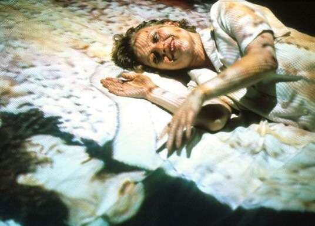
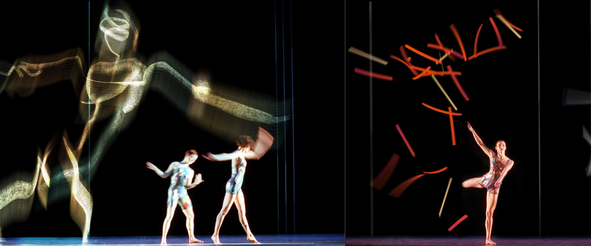
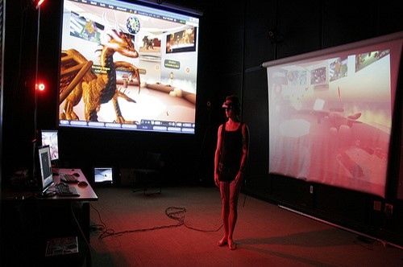
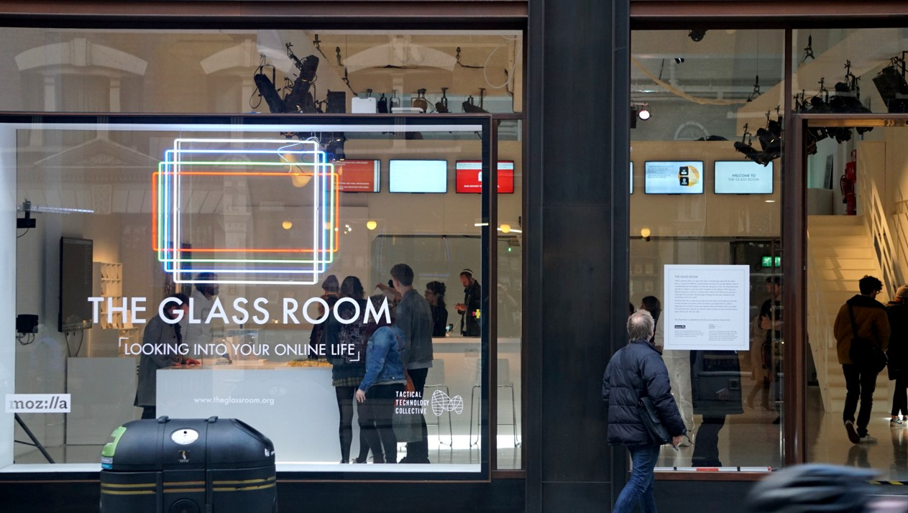
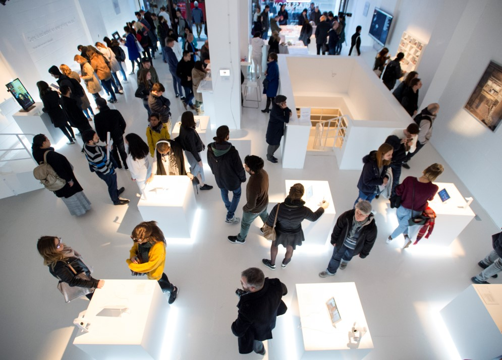
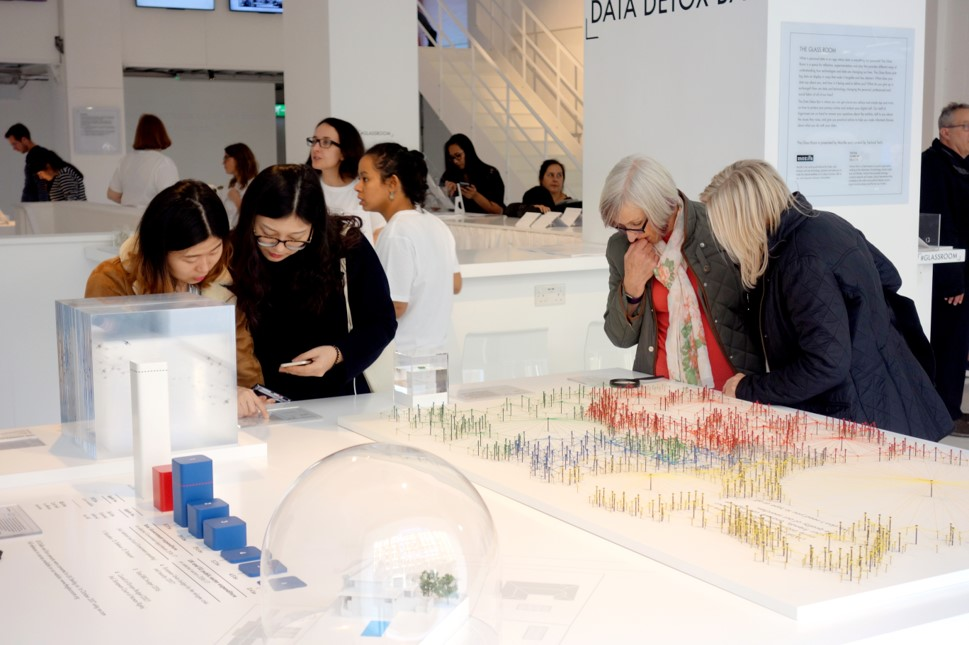
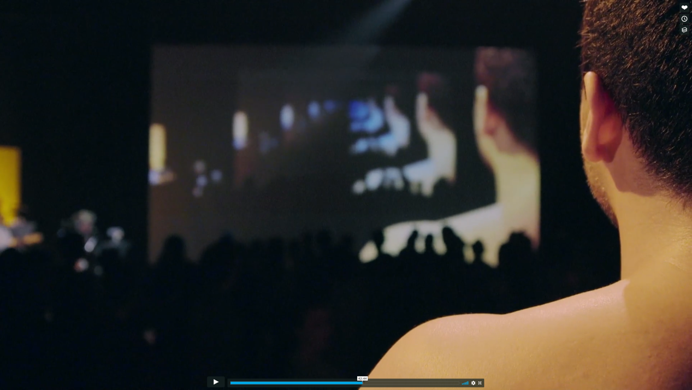

# Week 6: Performance

FM6102: Digital Play and Practice  
Dr. EL Putnam

---

## Assignment 3

You will develop a multimodal, digital work (examples: video essay, augmented reality, interactive installation, digital performance). This project should mark a departure in your practice to date and enable you to engage with an aspect of digital media that is novel for you.

### Proposal due Friday 25 February

150 to 250 word description of proposed project media and concepts to be explored. List of 3 relevant examples and 5 academic references.

---

## What is Digital Performance?

Defined as “all performance works where computer technology play a key  rather than subsidiary one in content, techniques, aesthetics, or delivery form” (Dixon 3) 

### Paul Sermon, [*Telematic Dreaming*](http://www.paulsermon.org/dream/), 1992

<!-- 
Performance by Susan Kozel

Not for lack of trying: haptic interfaces and media performance works, such as Susan Kozel

Critquing an idealist notion of telepresence and online interaction

Technology as filter or membranes for encounters with each other

Susan Kozel, who performed in the piece for four weeks in 1994, recalls experience of people hitting image of her on monitor; for the most part she felt connected to her image, except in this moment when she dissociated the two out of preservation

Salter: performance not limited to theatre and drama, but “Performance as practice, method, and worldview is becoming one of the major paradigms of the twenty-first century, not only in the arts but also the sciences.”

Emphasis on the embodied and material, btu also action: HOW things are used
“Technology,” writes performance studies scholar Barbara Kirschenblatt-Gimblett, “is integral to the history of performance” (2002, 48) and “performance is integral to the history of technology” (2002, 49). 
 -->

---

## Performance as mode of knowledge production

- Interest in enaction or doing
- Real-time, dynamic processes over static objects or representations
- Engagement with the temporal moment of the present
- Embodiment and materiality
- Immanent experience
- the effect of both human and nonhuman presence
- transmutation and reconstitution

<!-- Spanning a wide range of seemingly disconnected disciplines, what is at stake in all of these accounts is how performance as a mode of being in the world radically differs from representational forms of knowledge. In general, representation assumes a split between the representation, whether an image on the canvas or in the brain, a description in text or a line of code, and a thing or world to be represented—a referent.
 -->

---

## Merce Cunningham with Paul Kaiser and Shelley Eshkar, [*BIPED*](https://www.youtube.com/watch?v=YHeoYdDMbLI), 1999

<!-- Revolutionary dancer and choreographer; known for work with John Cage

Connection between dance and animation software

Michael Girard and Susan Amkraut at Ohio State University. Their alpha software, called Biped , was demonstrated at SIGGRAPH95 (1995) to considerable acclaim, and it became commercially available a year later, embedded within a larger animation package, Character Studio. 

In 1997, Kaiser and Eshkar invited Cunningham to collaborate on a project using Biped and 3D Studio Max that had already been broadly conceived, a virtual dance installation called Hand-drawn Spaces , and in 1998 Cunningham invited them to work on his full-length live dance project, appropriately entitled BIPED (figure 9.2).

A particular quality of the Girard and Amkraut’s Biped software was its attention to detail which made animated figures appear “lifelike,” so that, for example, a foot landing on the ground affected transformations throughout the rest of the body, which were triggered and computed within the program by code registering “the foot to ground collision response.” 18 Other detailed “kinematic” effects, including skin and tendon behaviors, were also mapped in using another module called “Physique,” developed by John Chadwick, and the software permitted combinations of movements to be easily interrelated, repeated, reversed or combined. For Cunningham’s dance, named after the software, Riverbed used motion-capture techniques to map in three dimensions the movements of three dancers performing some twenty Cunningham movement sequences in a studio (figure 9.3). Using reflective markers on the joints and body parts of the dancers, cameras around the studio relayed the images to computers, which calculated and rendered their kinetic shapes in relation to 3D space, and this data was then manipulated in Character Studio to create complex and beautiful hand-drawn figure animations performing the same dances (figure 9.4).

Dixon, Steve. Digital Performance : A History of New Media in Theater, Dance, Performance Art, and Installation, MIT Press, 2007. 
 -->

---

## Micha Cárdenas, [*Becoming Dragon*](https://michacardenas.sites.ucsc.edu/becoming-dragon/), 2008

<!-- In 2008, Cardenas performed Becoming Dragon, a 365 hour  mixed reality performance in second life

There can be little doubt that this notion of switching and metamorphosis has a prime significance for many practitioners: the ability to transform live movement into moving
image, or gesture into music, or solo dance into group dance, or one location into another
or several
 -->

---

## Blast Theory, [*Karen*](https://www.blasttheory.co.uk/projects/karen/), 2015

---

## Tactical Tech, [*Glassroom*](https://theglassroom.org/about/), 2017

---

## Tactical Tech, Data Detox Bar in *Glassroom*, 2017

---

## La Loma, [*We Know You*](https://theglassroom.org/exhibit/), 2017

<!-- Initially branded as disruptive upstarts, the five companies that have come to be known as GAFAM (Google, Apple, Facebook, Amazon, Microsoft) have become some of the biggest companies in the world and have amassed the largest shares of our data. These tech giants have made themselves indispensable in our lives, providing services that are as valuable as basic utilities. 

Collectively, they now wield an unprecedented level of power and influence that stretches across all aspects of our lives, from work to home to leisure. How many of their services do you rely on? And how much do these companies know about you? Each of the exhibits at this table explores a different way in which tech companies and the people who run them have become engrained in our lives. They know us, but how much do we really know about them?
 -->

---

## Yara Travieso, [*La Medea*](https://vimeo.com/user2057171), 2017

