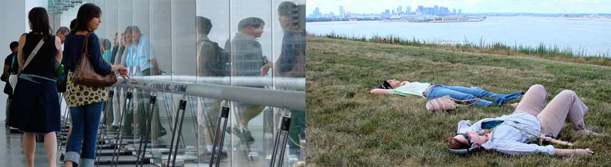

# Week 8: Locative Media

FM6102: Digital Play and Practice  
Dr. EL Putnam

---

## Locative Media: Significant Events

- 2000: President Clinton signed order to switch off selective availability (SA) on the Global Positioning System (GPS)
- 2003: “Locative Media Workshop: Mapping the Zone” took place in an abandoned Soviet era military base in Karosta, Latvia

<!-- The phrase “locative media” is attirbuted to Karlis Kalnins, who used it to differentiate digital art that is spatially localized (ie. Use GPS) from net art, or art that can be experienced on a computer desktop. Locative media has become increasingly popular over the past decade as a means of integrating digital art into the physical environment, beyond the context of the gallery and the computer screen.

From Zeffiro:

Rhetorically, the workshop focused on appropriating
and retooling surveillance and control infrastructures, and distributing these technologies
beyond the ‘command and control infrastructure’ (Hemment, 2004b: §6). The objective of the
gathering, apart from a general exploration, and cementing of locative media,6 included developing
a framework or ‘blueprint’ (Smite, 2003: §4), for a large-scale locative media event/installation,
as a part of the [RAM]5 workshop series, which was to be held in Riga in May 2004
(Locative Media, 2003: §1).

Literally overnight, turning off the feature changed typical accuracy from around 50m to 3m on a clear day. It is not an overstatement to say that if the US government had maintained SA, the types of locative media used today would not exist.

Frith, Jordan. Smartphones as Locative Media (Digital Media and Society) (p. 29). Wiley. Kindle Edition. 

-->

---

## Situationist International

- Psychogeography: study of effects of a given environment on the emotions and behavior of individuals
- Détournement: appropriating and annotating a familiar image, media work, or environment in order to subvert it
- Dérive: goal-less drifting

---

## Locative Media Critiques

- Simon Pope (2005): reconceptualization of SI does not intrinsically align with SI
- Brian Holmes (2004): recalls military-industrial nature of technology
- Andreas Broeckmann (Graham 2004): locative makes trackable

<!-- Different kind of locative media: people who are homeless

Quantiication and Virginia Eubanks: digital technology and the city not just about devices we use, but how space is used and allocated

Coordinated entry: seems good in principal, but as Eubanks points out, means accessing personal details that can be increased surveillance and scrutiny – sometimes increased quantification and automation inhibits the process

 -->

---

## Digital Media and the City

- 21st century city: influence of networked digital media on urban space
- New spatialisation
- Geomedia
    - Convergence
    - Ubiquity
    - Location-awareness
    - Real-time feedback
- “‘art’ has today become a key zone for incubating new types of urban encounter in which social relations are to the fore” (McQuire 95)

<!-- Scott McQuire: from media to geomedia
Mobile and embedded media devices
Transformation of social practice through ubiquity
Communication as situational: altering spatio-temporal parameters of situation
Cities are not structured by built environment

 -->

---

## [Playable City](https://www.playablecity.com/)

---

## Blast Theory, [Rider Spoke](https://www.blasttheory.co.uk/projects/rider-spoke/), 2007

---

## Teri Rueb, [Trace](http://terirueb.net/trace-1999/), 1999

---

## Teri Rueb, [Core Sample](http://terirueb.net/core-sample-2007/), 2007

---

## Teri Rueb, [Other Order](http://terirueb.net/other-order-2014/)

---

## Martin Cooper: Inventor of Mobile Phone

---

## History of Mobile Media

- 1894: Invention of radio
- 1956: First mobile phone system
- 1960s and 70s — 1G: used analogue technology
- 1980s — 2G: combine with digital technology and introduction of SMS
- 2000s — 3G: fiber optics and rise of Smartphones

<!-- we may trace the ancestry of the mobile phone back to Marconi and the invention of the radio in 1894: the mobile may be thought of as a combination of the radio and the telephone. Mobile radios could send and receive signals and were used experimentally in the US police force as early as the 1920s. These two-way radios were seen as being useful only for the emergency services and there were no plans to exploit the technology commercially. According to Lacohée, Wakeford and Pearson (2003), the commercial use of mobile telephones began in 1947 in the USA, when AT&T offered a radio-telephone service between New York and Boston. 

In 1956 in Sweden, Telesoniera and Ericsson created the first fully automatic mobile phone system, allowing calls to be made and received in a car, although using the public network telephone system. These phones were operating through the car’s battery and were weighing no less than 40 kilogrammes! The invention and spread of the transistor allowed for the development of lighter phones, but they were still too big to carry around. 

It was based on the creation of a cellular network that included a series of base stations which provided radio coverage over large geographical areas. 

1G is the first generation of mobile phones, which used analogue technology. It was based on the creation of a cellular network that included a series of base stations which provided radio coverage over large geographical areas. This is essentially what allows mobile phones to operate. In 1977, AT&T received a licence from the Federal Communications Committee to start building a cellular network in the USA. Given the size of America, this was not an easy task. In the meantime, in northern Europe, such networks were being developed since the late 1960s by the Nordic Mobile Telephone Group (NMT), and by 1981 Sweden already counted 20,000 mobile phone users (Lacohée et al., 2003). Spain, Austria, the Netherlands and Belgium used NMT services, while bigger countries such as Germany, France, Italy and Britain designed their own systems (Lacohée et al., 2003).

the speed and connectivity afforded by late 2G and early 3G, as well as the rise of wireless internet, led to the smartphone. 

 -->

---

## What's different?

- Portability and personalization
- Increased means of accessing internet
- Online mobile media portal
- Mobile paradox: global and local
- Convergence of mobile, social, and locative media
- More ubiquitous

---

## [Manifest.AR](http://www.manifest-ar.art/), [Augmented Reality at MoMA](http://www.sndrv.nl/moma/), 2010

<!-- Visitors of the AR exhibition - easily recognisable by their phones pointed at empty walls or spaces inbetween artworks. 

“Digital media have become increasingly personalized and embedded, and are widely used to activate local situations and connect to particular places. In other words, as much as digital media enable emancipation from place, they have also become a key modality of contemporary placemaking.”

McQuire, Scott. Geomedia: Networked Cities and the Future of Public Space (p. 6). Wiley. Kindle Edition. 

“Among the most active artists in the area of AR projects have been the Manifest.AR group and its key members Mark Skwarek (b. 1977), John Craig Freeman (b. 1959), Will Pappenheimer (b. 1954), Tamiko Thiel (b. 1957), Sander Veenhof (b. 1973), and John Cleater (b. 1969) [210, 211]. In 2010, Manifest.AR ‘hijacked’ the foyer of the Museum of Modern Art in New York as part of their exhibition ‘We AR in MoMA’, organized by Skwarek and Veenhof, which presented augmented reality art within the context of the traditional art museum, thereby both highlighting and questioning the physical boundaries of the institution and the virtuality of digital art.

Paul, Christiane. Digital Art (Third edition)  (World of Art) . Thames & Hudson. Kindle Edition. 
 -->

---

## Mark Skwarek, AR Occupy Wall Street, 2011, Screenshot montage

---

## John Craig Freeman, [Water wARs](https://johncraigfreeman.wordpress.com/water-wars/), 2011

<!-- “new potentials to remake the urban as a social space.”

McQuire, Scott. Geomedia: Networked Cities and the Future of Public Space (p. 12). Wiley. Kindle Edition. 

“Questioning the Venice Biennale’s status as one of the world’s most important forums for the dissemination of current developments in international art, Manifest.AR constructed virtual AR pavilions as counterpoints to the actual pavilions in which artists represent their nations in the Giardini in Venice. Playing on the 54th Biennale’s ‘ILLUMInations’ theme, the group positioned its intervention as one unbound by nation state borders, physical boundaries, or conventional art world structures.”

Paul, Christiane. Digital Art (Third edition)  (World of Art) . Thames & Hudson. Kindle Edition. 

From project website:

Water wARs anticipates the flood of environmental refugees into the developed world caused by environmental degradation, global warming and the privatization of the world’s drinking water supply by multinational corporations like Bechtel.

The project consists of a Water wARs Pavilion for undocumented artists/squatters and water war refugees. The Water wARs Pavilion will grow into a sprawling shantytown over course on the biennial from the June 4th to November 27th.

 -->
---

## John Craig Freeman, [Border Memorial: Frontera de los Muertos](https://johncraigfreeman.wordpress.com/border-memorial-frontera-de-los-muertos/), Lukeville border crossing, Arizona, 2012

---

## Tamiko Thiel, [Lotus Meditation](https://tamikothiel.com/AR/lotus-meditation.html), 2019

---

## Tamiko Thiel, [ReWildAR](https://aib.si.edu/futures_tamikothiel/), 2021

[ARpoise](http://arpoise.com/)

---

## Conor McGarrigle, [NAMALand](https://www.conormcgarrigle.com/namaland.html), 2010-12

---

## Locative Media and Mixed Reality Programmes

- [Echoes](https://echoes.xyz/): Sound mapping
- [Adobe Aero](https://www.adobe.com/products/aero.html)
- [ARCore](https://developers.google.com/ar)

