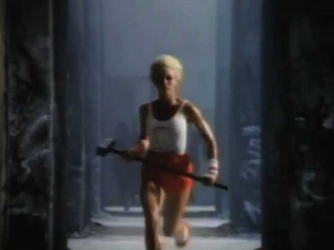
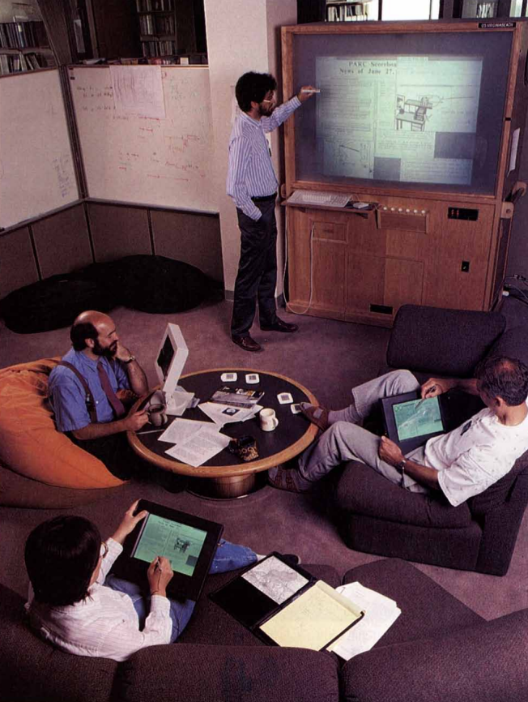
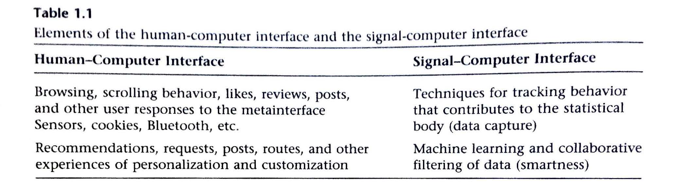
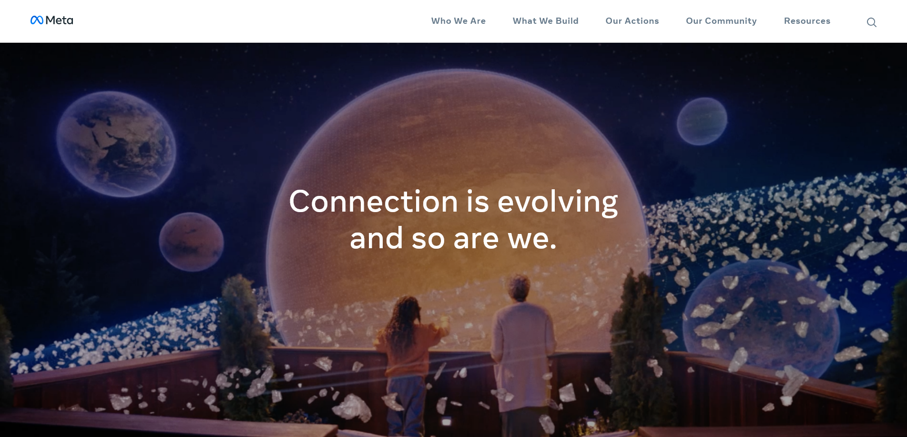

# Week 9: Metainterface

FM6102: Digital Play and Practice  
Dr. EL Putnam

---

## What is an interface?

- Space of interaction with technology
- Pre-21st Century: computer interface limited to desktop/laptop
- GUI: graphic user interface
- Changes in hardware, software, and infrastructures: cloud computing and internet of things (IOT)

[1984 Apple Macintosh Commercial](https://youtu.be/OYecfV3ubP8)

<!-- Up to 21st century, this was limited to desktops/laptops
Emphasis on office and work metaphors: hiding interface behind the GUI
Seamless interaction, but also becomes “new mileu for cultural practice” (Andersen and Pold 9)

Different about 21st century: change in hardware, software, and storage (cloud)
Rise of corporations (Apple, Amazon, Netflix) that control means of access: production, consumption, and storage
The metainterface is seamless, everywhere, and everything: become an industry that changes our relationship to everyday life

Interfaces have a grammar

The digital, online, networked, and so on, have become an intrinsic part of everyday life and routines, and it makes little sense to maintain that they have their own art form: all kinds of art— high or lively— now relate to and use digital technologies and platforms.Andersen, Christian Ulrik, and Soren Bro Pold. The Metainterface : The Art of Platforms, Cities, and Clouds, MIT Press, 2018. ProQuest Ebook Central, http://ebookcentral.proquest.com/lib/nuig/detail.action?docID=5891095.Created from nuig on 2021-04-19 07:17:52.

 -->

---

## What is ubiquitous computing?

Phrase coined by [Mark Weiser](https://www.jstor.org/stable/24938718): "The most prfound technologies are those that disappear. They weave themseves into the fabric of everyday life until they are indistinguishable from it" (94).

<!-- Image caption: "UBIQUITOUS COMPUTING begins to emerge in the form of live boards that replace chalkboards as well as in other devices at the Xerox Palo Alto Research Center. Computer scientists
gather around a live board for discussion. Building boards
and integrating them with other tools has helped researchers
understand better the eventual shape of ubiquitous computing. In conjunction with active badges, live boards can customize the information they display.  -->

---

## Internet of Things (IoT)

The interconnection via the Internet of computing devices embedded in everyday objects, enabling them to send and receive data (OED, 2017).

---

## Interface Criticism

- Metainterface is displaced (seamless), global (everywhere), and generalised (in everything)
- Interfaces are cultural-technological constructs
- Changing and becoming increasingly complex
- Appear minimal / “blackboxed to users”

<!-- From being contained to hardware and software to “being mobile, limitless, and almost reckless and dissolute in the ways it incorporates a constant flow of data from other interfaces” (17)

Not just HCI, but also incvoles data capture (signal-computer interace) that inscribes behaviors; “activities are reorganised in order to become traceable” (31) 

Humans act more like machines, becoming a programmed actor
 -->

---

## Benjamin Grosser, [Facebook Demetricator](https://bengrosser.com/projects/facebook-demetricator/), 2012

---

---

## We need to talk about [Meta](https://about.facebook.com/meta/)

---

## Reality Technologies

- Blanket statement to describe 360, Augmented Reality, Virtual reality, Mixed Reality (360/AR/VR/MR)
- 1787: Robert Baker and the panorama and the cyclorama
- 1838: Invention of the stereoscope
- 1839: Louis Daguerre invented daguerreotype
- 1890s: Invention of cinema
- 1950s and 60s: experiments in cinematic immersion, including Morton Heilig's "sensorama" and Disney's "Circle Vision 360"

<!--  Sensorama in 1962 and created five short films which engaged multiple senses (sight, sound, smell, and touch)

Disney joined in the virtual revolution implementing it in their parks. They coined a new term for the technology calling it Circle Vision 360. A similar technique to that of the Cinéorama was employed with synchronised projectors pointing towards different angles of a room to create one cohesive immersive video experience.

 -->

 ---

- 1980s: Jason Lanier founded VPL Research and popularised term "virtual reality"
- 2007: launch of street view on Google Maps
- 2010: New push for VR technologies with Oculus Rift, HTV Vive and Playstation VR
- 2015: Launch of Google Cardboard and 360 degree uploads introduced to Facebook and Youtube

 

 <!--
 
 By the 1980s, the term “virtual reality” had been popularised by Jaron Lanier, one of the modern pioneers of the field. Lanier founded the company VPL Research in 1985, which has developed a number of VR devices that integrate visuals with haptic and auditory experiences. VPL licensed the DataGlove technology to Mattel (the same toy company which owns View Master), which used it to make the Power Glove, an early affordable VR device.
 
  "VPL" stood for "Virtual Programming Languages"
  
Google launched Google Cardboard, a simple and inexpensive VR headset which only required a mobile phone to work. -->

---

## Creating Virtual Worlds

- [360 camera](https://www.insta360.com/product/insta360-onex2?msclkid=d43c237673a4130e76024151345653cd)
- [Google Tilt Brush](https://www.tiltbrush.com/)
- [Tinkercad](https://www.tinkercad.com/)
- [Mozilla Hubs](https://hubs.mozilla.com/)
- [NUIG MakerSpace](https://nuigalway.libcal.com/reserve/equipment/MakerSpace)

